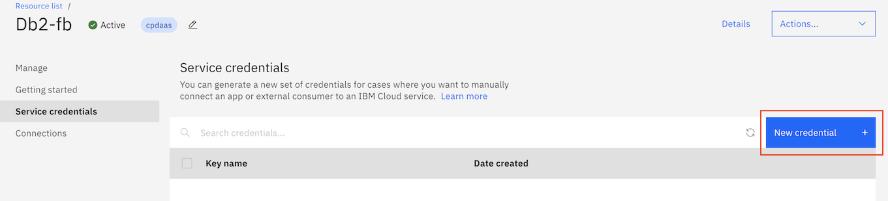
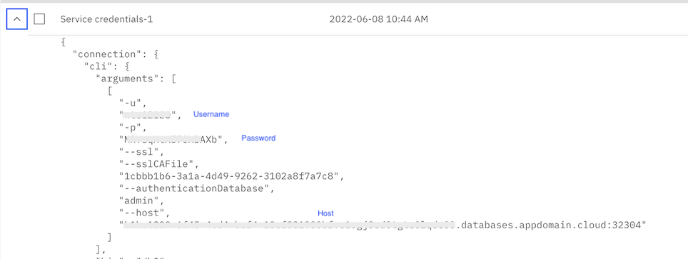
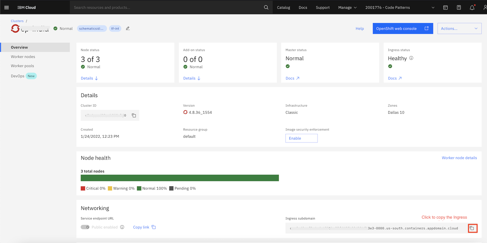

# Establish identity & trust during chatbot interactions using IBM Security Verify

Chat bots are becoming a popular way to interact with customers. In any business conversation, validation of the customer identity is very essential. Identity verification prevents anyone from carrying out an action on other people's behalf, creating false identities, or committing fraud. IBM Security Verify can be used to establish identity and trust during chatbot interactions.

[IBM Security Verify](https://www.ibm.com/verify/verify-identity) protects users and applications with a cloud-native, software-as-a-service (SaaS) approach that leverages the cloud. Beyond `single-sign on` and `multifactor authentication`, Verify is a modernized, modular IDaaS that provides deep AI-powered context for [risk based authentication and adaptive access](https://www.ibm.com/verify/verify-identity/adaptive-access). IBM Security Verify provides a centralized user management interface that can be managed through the admin UI or automatically through REST APIs. It is built upon open standards such as `OpenID Connect and SAML 2.0`. There are a number of multifactor verification methods available out-of-the-box like `SMS, Email, Voice callback one-time passcode, Push notification approval, Knowledge questions` and so on. 

This code pattern uses the single-sign on authentication and email based multifactor verification method.

This code pattern demonstrates a scenario in the `Online Retail` domain where customers register on the portal, and subsequently login to the portal to shop for merchandise. After a customer has purchased items, they want to perform the below operations:
- Check the status of the order
- Cancel the order

These two operations can be done with a conversational chatbot without a need to login to the portal. Chatbot is integrated with the webapp to avoid the hassle of logging into the portal to check order status or cancel the order. The identity of the user needs to be ascertained to allow these two operations. Though the user  need not login to start conversation with chatbot, the user is authenticated by `verifying email-id and the one time code` sent by Security Verify. Once the identity is ascertained, the chatbot allows user to communicate further regarding their orders.

The code pattern explains the following:
* Add SSO to a Java based webapp
* Design chatbot conversation using Watson Assistant
* Implementing IBM Cloud Functions to be used as webhook with chatbot
* Integration of Security Verify with Watson assistant to establish identity and trust (Chatbot security)

## Flow

## Pre-requisites

- [IBM Cloud account](https://cloud.ibm.com/)
- [Red Hat OpenShift cluster](https://cloud.ibm.com/kubernetes/catalog/create?platformType=openshift) to deploy webapp.
- [IBM Security Verify SaaS Tenant](https://www.ibm.com/verify/verify-identity) - Trial login can be used for this code pattern.
- [Git client](https://git-scm.com/downloads)
- [The OpenShift CLI (oc)](https://cloud.ibm.com/docs/openshift?topic=openshift-openshift-cli)

## Steps

1. [Clone the repository](#1-clone-the-repository)
2. [Create IBM Cloud Services](#2-create-ibm-cloud-services)
3. [Configuration of services](#3-configuration-of-services)
4. [Deploy E-Commerce Portal Application](#4-deploy-e-commerce-portal-application)
5. [Create Cloud Functions Action](#5-create-cloud-functions-action)
6. [Setup Watson Assistant Chatbot](#6-setup-watson-assistant-chatbot)
7. [Access the Application](#7-access-the-application)

### 1. Clone the repository

From a command terminal, run the below command to clone the repo:
```
git clone https://github.com/IBM/secure-chatbot-interactions-using-security-verify
```

### 2. Create IBM Cloud Services

#### 2.1 Sign up for IBM Security Verify

Click [Security Verify](https://www.ibm.com/account/reg/signup?formid=urx-30041) to sign up for Security Verify. After you sign up for an account, the account URL (https://[tenant name].verify.ibm.com/ui/admin) and password is sent in an email.

#### 2.2 Create IBM DB2 Service instance

Login to IBM Cloud, in [IBM Cloud Catalog](https://cloud.ibm.com/catalog) search of DB2. Click on the Db2 tile.

Select an appropriate plan. Read and accept the license agreement. You may leave the other options to their default values. Click on `Create` button. It will take a minute or so to provision an instance.

**Make a note of service credentials**
- Click the newly created db2 entry in [IBM Cloud Resource list](https://cloud.ibm.com/resources)
- Click `Service credentials` on the left hand side navigation menu. If there are no credentials, then click on `New credential` button and create new credentials. 



**Note the username, password, host and port of the DB2 instance. The will be needed for configuring ECommerce Portal Application, Watson Knowledge Catalog and Watson Query**



#### 2.3 Create Watson Assistant Service instance

* Login to IBM Cloud, in [IBM Cloud Catalog](https://cloud.ibm.com/catalog) search of Assistant and create a Watson Assistant service by selecting the **Lite** plan and clicking on **Create**.


* Click **Launch Watson Assistant** to launch console.

#### 2.4 Create an instance of OpenShift cluster

Go to this [link](https://cloud.ibm.com/kubernetes/catalog/create?platformType=openshift) to create an instance of OpenShift cluster.

Make a note of the `Ingress Subdomain URL`:


### 3. Configuration of services

#### 3.1 Configure Security Verify

Please follow the instructions [here](SECURITY_VERIFY_CONFIG.md) to configure Security Verify.

### 4. Deploy E-Commerce Portal Application
**Login to your OpenShift cluster from command line**

Login to your OpenShift cluster. Access the `IBM Cloud Dashboard > Clusters (under Resource Summary) > click on your OpenShift Cluster > OpenShift web Console`. Click the dropdown next to your username at the top of the OpenShift web console and select Copy Login Command. Select Display Token and copy the oc login command from the web console and paste it into the terminal on your workstation. Run the command to login to the cluster using `oc` command line.

#### 4.1 Configure E-Commerce Portal Service

**4.1.1 Changes to server.xml**

In the cloned repo folder - go to `src/main/liberty/config`. Open `server.xml`.

Make the below changes for the `openidConnectClient` element and save the file:
- Replace {{ingress-sub-domain}} with `Ingress subdomain` of the OpenShift cluster.
- Replace {{clientId}} and {{clientSecret}} with the Client ID and Client secret noted on the `Sign-on` tab of Security Verify.
- Replace {{tenantId}} with the tenant id of Security Verify noted at the time of creation.

```
<openidConnectClient id="home"
		signatureAlgorithm="RS256"
		httpsRequired="false"    
		redirectToRPHostAndPort="http://ecomm-portal-chatbot.{{ingress-sub-domain}}/insportal/app"
		clientId="{{clientId}}"
		clientSecret="{{clientSecret}}"
		authorizationEndpointUrl="https://{{tenantId}}.verify.ibm.com/v1.0/endpoint/default/authorize"
		tokenEndpointUrl="https://{{tenantId}}.verify.ibm.com/v1.0/endpoint/default/token"></openidConnectClient>
```

**4.1.2 Changes to db.config**

In the cloned repo folder - go to `src/main/resources`. Open `db.config`.

Replace the {{host}} and {{port}} with the host and port you noted during Db2 credentials creation. Enter the userid, password and schema with the username, password and username(in uppercase). Save the file.
> Note: the schema should be in uppercase of the username noted in Db2 credentials.
```
jdbcurl=jdbc:db2://{{host}}:{{port}}/bludb:sslConnection=true;
userid=
password=
schema=
```

**4.1.3 Changes to verify.config**
In the cloned repo folder - go to `src/main/resources`. Open `verify.config`.

Make the below changes and save the file:
- Replace {{tenant-id}} with the tenant id of Security Verify noted at the time of creation.
- For `clientId` and `clientSecret` enter the Client ID and Client secret noted on the `Sign-on` tab of Security Verify.
- For `apiClientId` and `apiClientSecret` enter the Client ID and Client secret noted on the `API Access` tab of Security Verify.

```
introspectionUrl=https://{{tenant-id}}.verify.ibm.com/v1.0/endpoint/default/introspect
tokenUrl=https://{{tenant-id}}.verify.ibm.com/v1.0/endpoint/default/token
userInfoUrl=https://{{tenant-id}}.verify.ibm.com/v1.0/endpoint/default/userinfo
clientId=
clientSecret=
usersUrl=https://{{tenant-id}}.verify.ibm.com/v2.0/Users
apiClientId=
apiClientSecret=
```

**4.1.4 Embed chatbot on the home page of the E-Commerce Portal Application**

In the cloned repo folder - go to `src/main/resources`. Open `home.html`. 
Embed the chatbot script element before the closing`body` tag.
>Note: Replace the `integration ID`, `region` and `instance ID` of the Watson Assistant deployed in previous section. 
```
<script>
		window.watsonAssistantChatOptions = {
			integrationID : "fxxxxeb", // The ID of this integration.
			region : "eu-gb", // The region your integration is hosted in.
			serviceInstanceID : "bxxxxx4", // The ID of your service instance.
			onLoad : function(instance) {
				instance.render();
			}
		};
		setTimeout(function() {
			const t = document.createElement('script');
			t.src = "https://web-chat.global.assistant.watson.appdomain.cloud/versions/"
					+ (window.watsonAssistantChatOptions.clientVersion || 'latest')
					+ "/WatsonAssistantChatEntry.js"
			document.head.appendChild(t);
		});
</script>
```
#### 4.2 Deploy E-Commerce Portal application
On the terminal window, got to the repository folder that we cloned earlier. 
Go to the directory - `sources/ins-portal-app/src/main/java/com/example/legacy/ecomm/`.
Open the file `ECommAppEndpoint.java`.

Replace the placeholder `{{ingress-sub-domain}}` with the ingress sub domain of the OpenShift cluster you noted earlier. Save the file.
```
private static String ingressSubDomain = "ecomm-portal-chatbot.{{ingress-sub-domain}}/";
```

Now change directory to `/sources/ecomm-portal` in the cloned repo folder.
Run the following commands to deploy `E-Commerce Portal application`.
```
oc new-project chatbot
mvn clean install
oc new-app . --name=ecomm-portal --strategy=docker
oc start-build ecomm-portal --from-dir=.
oc logs -f bc/ecomm-portal
oc expose svc/ecomm-portal
```
Ensure that the application is started successfully using the command `oc get pods`. Also make a note of the route using the command `oc get routes`. 

#### 4.3 Configure Db2 database

In this step, we will create two tables in the Db2 database - CUSTOMER and ORDERS table.

Invoke the URL - http://ecomm-portal-chatbot.{{IngressSubdomainURL}}/portal/ecomm/setupdb

>Note: Replace {{IngressSubdomainURL}} with `Ingress subdomain` of the OpenShift cluster.


### 5. Create Cloud Functions Action

Login to your IBM Cloud account. On the dashboard, click on the hamburger menu and navigate to `Functions` and click on `Actions`.

Click the `Create` button to create a new action. 
Enter a name for action under `Action Name`. Leave `Enclosing Package` as `(Default Package)` itself. Under `Runtime` select option for Node.js.

Click on `Create` button. You are presented with actions code editor. Replace the existing code with the javascript code [here]().

Next, in the javascript code, update the value of following variables (mentioned in the beginning of the file):

```
//Security Verify Details
var tenant_url = "xxxx.verify.ibm.com"
var client_id = "xxxx"
var client_secret = "xxxx"

//API Details
var GET_ACTIVE_ORDERS_URL='http://<openshift_url>/portal/ecomm/auth/getactiveorders'
var GET_ALL_ORDERS_URL = 'http://<openshift_url>/portal/ecomm/auth/getorders'
var CANCEL_ORDER_URL = 'http://<openshift_url>/ecomm/auth/cancelorder'
```

>Note: Please use the security verify credentials noted in step #< > and the APIs URL as noted in step #< >.

Click `Save` button on the top right of the code editor. 

#### Enable cloud function action as web action

For the action just created, click `Endpoints` on the left side navigation menu. Select the checkbox `Enable as Web Action`. Click the `Save` button on the right top corner. When saved, `Copy web action url` icon, under `Web Action` section is enabled. Click the icon to copy the webhook url. This URL will be used in Watson Assistant for it to call the actions in Cloud Functions.


### 6. Setup Watson Assistant Chatbot

Login to IBM Cloud. On the dashboard, click on the hamburger menu and click `Resource List`. Click on the Watson Assistant instance that you created earlier. Then click on `Launch Watson Assistant` button to launch Watson Assistant dashboard.

On the Watson Assistant dashboard, on the left side of the screen click on `skills` icon. Click `Create skill` button. Select `Dialog skill` and click `Next`. 

Select `Upload skill` tab. The skill file is available [here](). Click `Drag and drop file here or click to select a file` and select the skill file from your cloned Github Repo folder. Click `Upload`.

The dialog skill should be imported now. Next, click `Options` on left navigation menu for the skill. `Webhooks` under `Options` is selected by default. On this page under `URL`, enter the Webhook url you copied in the above section and append the URL with `.json`.
**Note: Append the url with .json extension. Without the extension, functions won't be called**
The entered details are saved automatically.

Next, click `Assistants` option available on the top left side of the Watson Assistant dashboard. Click `Create assistant`. In `Create Assistant` window, under `Name` enter a name for the assistant. Optionally enter a description and click the `Create assistant` button. 

In the next window, click `Add an action or dialog skill`. In `Add Actions or Dialog skill` click on the skill that you created earlier.

### 7. Access the Application


## Summary

## License
This code pattern is licensed under the Apache License, Version 2. Separate third-party code objects invoked within this code pattern are licensed by their respective providers pursuant to their own separate licenses. Contributions are subject to the [Developer Certificate of Origin, Version 1.1](https://developercertificate.org/) and the [Apache License, Version 2](https://www.apache.org/licenses/LICENSE-2.0.txt).

[Apache License FAQ](https://www.apache.org/foundation/license-faq.html#WhatDoesItMEAN)
